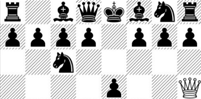
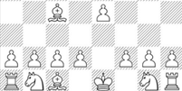

# assignment3

    

        <table border="2" id="header">
            <tr>
                <td><strong>وبلاگ من</strong></td>
                <td><a href="#">&#127968 خانه</a></td>
                <td><a href="#">&#128202 پروژه ها</a></td>
                <td><a href="#">&#128229 دانلودها</a></td>
                <td><a href="#">&#128222 درباره من</a></td>
                <td><a href="#">&#128241 تماس با من</a></td>
                <td colspan="2">
                    <form action="">
                        <input type="search" name="search-box" placeholder="search">
                        <button name="search">جستجو</button>
                    </form>
                </td>
            </tr>
        </table>
         
        <table border="2" class="media-table">
            <tr>
                <td>
                    <h3>آپارات</h3>
                    <iframe src="https://www.aparat.com/video/video/embed/videohash/gsKot/vt/frame" allowFullScreen="true" webkitallowfullscreen="true" mozallowfullscreen="true" class="iframe-video"></iframe>
                </td>
                <td>
                    <h3>یوتیوب</h3>
                    <iframe src="https://www.youtube.com/embed/oI57XJAcC4Q" title="YouTube video player" frameborder="0" allow="accelerometer; autoplay; clipboard-write; encrypted-media; gyroscope; picture-in-picture" allowfullscreen class="iframe-video"></iframe>
                </td>
                <td>
                    <h3>&#127916; ویدیو</h3>
                    <video controls>
                        <source src="media/pexels-nothing-ahead-10505868.mp4" type="video/mp4">
                    </video>
                </td>
            </tr>
            <tr>
                <td>
                   

                        1.
                        <audio controls>
                            <source src="media/Ghazal Shakeri - Ghollak.mp3" type="audio/mp3">
                        </audio>
                   

                   

                        2.
                        <audio controls>
                            <source src="media/Ghazal Shakeri - Ghollak.mp3" type="audio/mp3">
                        </audio>
                    

                    

                        3.
                        <audio controls>
                            <source src="media/Ghazal Shakeri - Ghollak.mp3" type="audio/mp3">
                        </audio>
                    

                </td>
                <td>
                    
                    <iframe src="https://www.google.com/maps/embed?pb=!1m14!1m12!1m3!1d102874.10435372501!2d59.62499612275392!3d36.316774400000014!2m3!1f0!2f0!3f0!3m2!1i1024!2i768!4f13.1!5e0!3m2!1sen!2s!4v1646425801855!5m2!1sen!2s" style="border:0;" allowfullscreen="" loading="lazy" class="map"></iframe>
                    
                </td>
                <td>
                    <form action="">
                        
نام کاربری

                        <input type="text" name="user-name">
                        
گذرواژه

                        <input type="password" name="password">
                        
کد امنیتی

                        
                         
                        <button name="login">ورود</button>
                    </form>
                </td>
            </tr>
        </table>
        <footer>
            
All rights reserved &copy; | 2022

        </footer>
    

